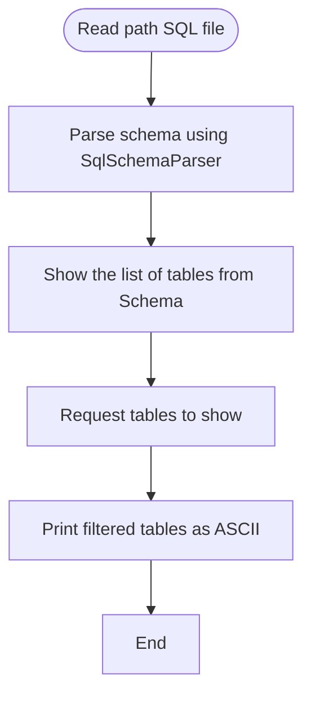

# JSqlParser POC

This is a Proof of Concept (PoC) tool that reads a SQL DDL file and maps its structure into Java domain entities such as `Schema`, `Table`, `Column`, `PrimaryKey`, `ForeignKey`, and `Unique` constraints.

## What it does

- Reads a SQL DDL file (e.g., `hr.sql`).
- Parses the schema using `SqlSchemaParser`.
- Extracts tables, columns, primary keys, foreign keys, and unique constraints.
- Filters tables by allowed names.
- Prints filtered tables as ASCII tables in the console.

## Workflow


## How to run

1. Place your SQL DDL file under `src/main/resources/` (e.g., `hr.sql`).
2. Modify `Main.java` to set allowed tables and the file path if needed.
3. Run the `Main` class:
   ```bash
   mvn compile exec:java -Dexec.mainClass=org.sqlparser.Main